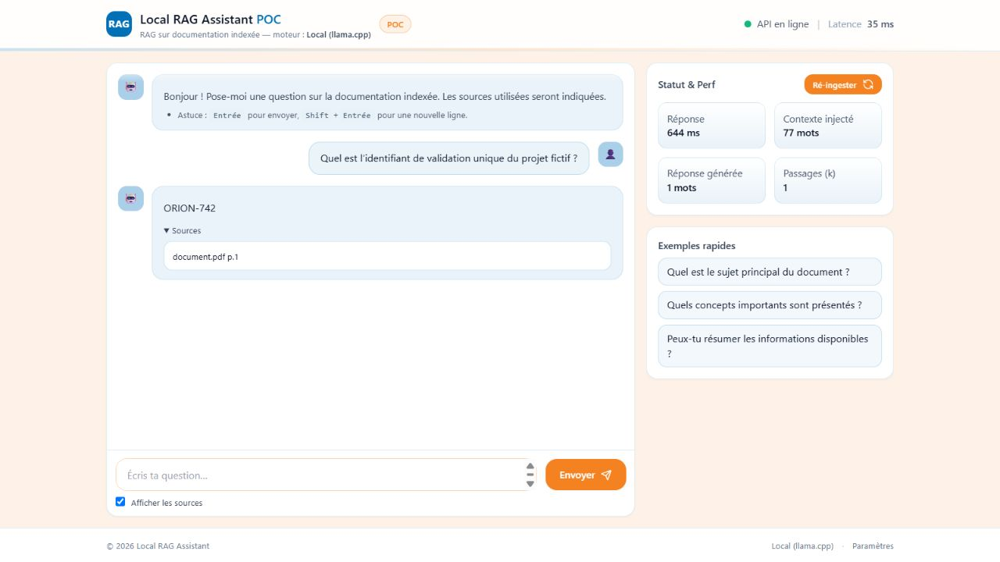

# Local RAG Assistant

POC local de question-réponse sur un document PDF. L’application extrait le texte, construit un index vectoriel ChromaDB, sélectionne des passages pertinents puis demande à un modèle GGUF servi par `llama.cpp` de produire une réponse sourcée.

Le dépôt ne contient ni modèle, ni document d’entrée, ni index préconstruit. Ces éléments restent locaux.



## Architecture

```text
Navigateur ── FastAPI ── ChromaDB ── sentence-transformers
                   │
                   └── llama-server ── modèle GGUF local
```

- `api/` : API, ingestion, recherche vectorielle et génération.
- `web/` : interface HTML/JavaScript sans étape de build.
- `scripts/generate_demo_pdf.py` : génération d’un document de test neutre.
- `tests/` : smoke tests sans modèle, PDF ou index réel.
- `ops/` : configuration nginx utilisée par Docker Compose.
- `llama.cpp/` : sous-module épinglé du serveur local.
- `Models/`, `data_in/`, `chroma_db/` : données locales ignorées par Git.

## Prérequis

- Git avec prise en charge des sous-modules.
- Python 3.10.
- [`uv`](https://docs.astral.sh/uv/) ou `pip`.
- Un modèle GGUF compatible, obtenu séparément et placé dans `Models/`.
- Pour le chemin Windows/GPU vérifié : Visual Studio Build Tools 2022, CUDA Toolkit 12.8 et GPU NVIDIA compatible.

Le modèle GGUF n’est pas redistribué. Vérifiez sa licence avant utilisation ou démonstration.

## Installation native sous Windows

```powershell
git clone --recurse-submodules <URL_DU_DEPOT>
cd local-rag-assistant-poc
Copy-Item .env.example .env
uv venv --python 3.10 .venv
uv pip install --python .venv\Scripts\python.exe -r requirements.txt
```

Placez votre modèle dans `Models/`, puis adaptez uniquement son nom dans `.env` :

```dotenv
LLAMA_MODEL=model.gguf
```

### Compiler llama.cpp avec CUDA 12.8

La configuration suivante a été validée pour une architecture NVIDIA `86` :

```powershell
$cmake = "C:\Program Files (x86)\Microsoft Visual Studio\2022\BuildTools\Common7\IDE\CommonExtensions\Microsoft\CMake\CMake\bin\cmake.exe"
& $cmake -S llama.cpp -B llama.cpp/build-cuda12 -G "Visual Studio 17 2022" -A x64 `
  -DGGML_CUDA=ON `
  -DCMAKE_CUDA_ARCHITECTURES=86 `
  -DCUDAToolkit_ROOT="C:\Program Files\NVIDIA GPU Computing Toolkit\CUDA\v12.8" `
  -DLLAMA_CURL=OFF
& $cmake --build llama.cpp/build-cuda12 --config Release --target llama-server --parallel
```

Le build est local et ignoré par Git. `.env.example` utilise :

```dotenv
LLAMA_SERVER_EXE=llama.cpp/build-cuda12/bin/Release/llama-server.exe
LLAMA_CTX_SIZE=4096
LLAMA_BATCH=256
LLAMA_N_GPU_LAYERS=999
```

## Démonstration reproductible

Générez le PDF neutre fourni par le projet. Le fichier produit reste ignoré par Git :

```powershell
.\.venv\Scripts\python.exe scripts\generate_demo_pdf.py
```

La configuration de démonstration isole les données dans `chroma_db/demo` et la collection `local_rag_demo`.

Démarrez llama.cpp :

```powershell
.\start_llama.bat
```

Dans un second terminal :

```powershell
.\.venv\Scripts\python.exe -m uvicorn api.main:app --host 127.0.0.1 --port 8000
```

Ouvrez <http://127.0.0.1:8000>, puis construisez l’index :

```powershell
Invoke-RestMethod -Method Post -Uri http://127.0.0.1:8000/ingest
```

Question de démonstration : `Quel est l’identifiant de validation unique du projet fictif ?`

## API

- `GET /` : interface web.
- `GET /health` : disponibilité de llama.cpp et du répertoire ChromaDB.
- `POST /ingest` : reconstruit l’index depuis `PDF_IN`.
- `POST /chat` avec `{ "question": "..." }` : produit une réponse et ses sources.

Aucun autre endpoint n’est exposé par le POC.

## Vérifications

```powershell
uv pip check --python .venv\Scripts\python.exe
.\.venv\Scripts\python.exe -m compileall -q api scripts tests start_llama.py
uvx ruff check api scripts tests start_llama.py
.\.venv\Scripts\python.exe -m unittest discover -s tests -v
```

Validation native effectuée sur une RTX 3060 Laptop 6 Gio : modèle local de 4,07 Gio, contexte 4096, batch 256, 33/33 couches sur GPU. La consommation observée pendant le test était d’environ 5,2 Gio sur 6 Gio. Ces chiffres décrivent cette machine, pas une exigence universelle.

## Docker Compose

Les trois services d’origine sont conservés : API, llama.cpp et nginx.

```powershell
docker compose up --build
```

- Interface via nginx : <http://127.0.0.1:8088>
- API directe : <http://127.0.0.1:8000>

Ce parcours n’a pas été exécuté pendant l’audit, Docker n’étant pas installé sur la machine de validation. La configuration utilise une image llama.cpp CUDA et n’offre pas de variante CPU implicite.

## Limites et sécurité

- POC local sans authentification ni contrôle d’accès.
- `/ingest` reconstruit la base et ne doit pas être exposé publiquement.
- Les réponses dépendent du document, du modèle et des réglages de génération.
- Le premier usage des embeddings peut télécharger le modèle configuré.
- Les bibliothèques de l’interface sont chargées depuis des CDN externes.
- Les modèles, documents et index locaux ont leurs propres contraintes de licence et de confidentialité.

Ne déployez pas cette configuration directement sur Internet sans authentification, restrictions réseau et gestion adaptée des données.

## Licence

Le code propre à ce dépôt est distribué sous licence MIT. Le sous-module, les dépendances, les modèles et les documents restent soumis à leurs licences respectives.
